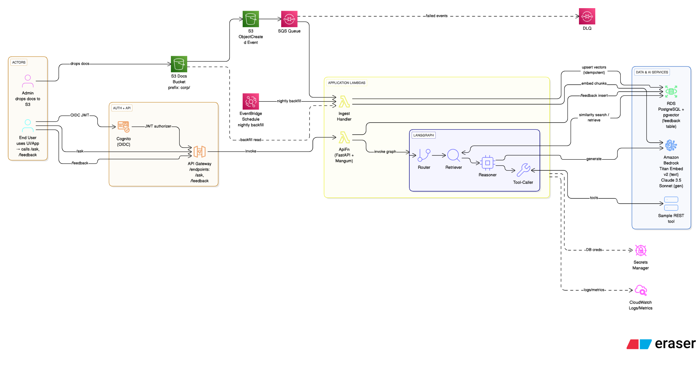

# Agentic RAG on AWS (LangGraph + Bedrock + pgvector)

Production‑grade reference showing Agentic RAG on AWS with **LangGraph**, **Amazon Bedrock**, **RDS for PostgreSQL + pgvector**, and secure APIs via **API Gateway + Lambda + Cognito**.  
Includes **auto‑ingestion**, feedback (HITL), metrics, and infra as code with **CDK**.

Demo uses `.txt`/`.md` docs in S3 for simplicity. Real deployments typically pull from Confluence, PDFs, or web pages — see the *Ingestion* section for how to enable BeautifulSoup and PyPDF.

---

## ✨ What you get

- **Agent graph (LangGraph):** Router → Retriever → Reasoner → Tool‑Caller  
- **RAG:** Bedrock text embeddings + pgvector similarity search  
- **Secure API:** API Gateway + Lambda protected by Cognito (JWTs)  
- **Auto‑ingest:** S3 ObjectCreated → SQS → Lambda ingest (+ optional nightly backfill by EventBridge)  
- **HITL:** `/feedback` endpoint → stored in Postgres  
- **Observability:** CloudWatch logs, metrics, dashboard + basic alarms  
- **Infra as Code:** VPC, S3, SQS (+ DLQ), EventBridge schedule, RDS Postgres, Lambdas, API GW, Cognito (CDK)

---

## 🧭 Architecture

Functional view:




**Data flow**  
- **Auto‑ingest:** Admin drops docs in S3 → S3 `ObjectCreated` event → SQS → *Ingest Lambda* reads S3 → chunk → embed (Bedrock Titan Embed v2) → upsert doc & chunks into Postgres `pgvector` (idempotent).  
- **Nightly backfill (optional):** EventBridge Schedule invokes Ingest Lambda to reconcile a prefix (e.g., `corp/`) and pick up missed/updated objects.  
- **/ask:** API Gateway (Cognito authorizer; use `ID_TOKEN`) → *ApiFn* (FastAPI + Mangum) → LangGraph (Router → Retriever → Reasoner → Tool‑Caller). Retriever runs pgvector **ANN** search, Reasoner synthesizes an answer, and tools (optional) are called via API.  
- **/feedback:** API → *ApiFn* → insert into `feedback` table for evals.  
- **Observability:** Lambdas emit logs/metrics to CloudWatch; Secrets come from Secrets Manager.

---

## 🧱 Tech choices (why)

- **Postgres + pgvector:** Simple, portable vector store with strong SQL. No extra service to run.  
- **Bedrock:** Managed access to multiple FMs; **Titan Embed v2** is fast, cost‑efficient.  
- **LangGraph:** Declarative agent graphs with tools/branches and retry policies.  
- **API GW + Lambda + Cognito:** Quick to secure, serverless scale, easy JWT auth from curl or apps.  
- **VPC endpoints (optional):** Avoid NAT costs by keeping traffic on AWS private network.

---

## ✅ Prerequisites

- macOS/Linux shell, **Python 3.11**, **Node 18+**, **Docker (running)**  
- **AWS CLI v2** configured (`aws configure`)  
- **CDK v2** (we use `npx -y aws-cdk@2 ...` so no global install needed)  
- **Bedrock model access** enabled in your Region (e.g., `ap-south-1`)  
- Optional for DB admin: pgAdmin or `psql`, **Session Manager plugin** (`brew install --cask session-manager-plugin`)

---

## 📂 Repo layout

```
.
├─ app/
│  ├─ main.py                # FastAPI app (health, ask, feedback)
│  ├─ lambda_handler.py      # Mangum entrypoint
│  ├─ bedrock.py             # Bedrock (embed/generate)
│  ├─ retrieval.py           # pgvector queries, SQL, ANN index
│  ├─ graph.py               # LangGraph graph
│  ├─ tools.py               # Example tool calls
│  ├─ metrics.py             # CloudWatch metrics/logs
│  ├─ config.py              # Settings (env)
│  └─ ingest_handler.py      # Lambda ingestion entrypoint (S3→SQS→Lambda + backfill)
├─ infra/
│  └─ cdk/
│     ├─ app.py
│     ├─ stacks/agentic_rag_stack.py   # VPC, S3(+events), SQS(+DLQ), EventBridge, RDS, Lambdas, API GW, Cognito
│     ├─ requirements.txt
│     └─ cdk.json
├─ sample-docs/              # Demo docs (txt/md) under corp/
│  └─ *.md
│  └─ *.txt
├─ scripts/
│  ├─ get_cognito_jwt.sh     # Fetch ID/Access token via Cognito
│  ├─ upload_sample_docs.sh  # Sync sample docs to S3
│  └─ nightly_eval_job.py    # (optional) evals sketch
├─ docs/
│  └─ functional-architecture.png  # (exported image; add your file here)
├─ tests/
└─ README.md
```

---

## 🔧 Setup & Deploy

#### 1) Create/activate a virtualenv (optional for app dev)

```bash
python3.11 -m venv .venv && source .venv/bin/activate
pip install --upgrade pip
```

#### 2) Deploy infra (CDK)

We use **Docker bundling** for Lambda dependencies — ensure Docker is running.

```bash
cd infra/cdk
pip install -r requirements.txt

# Bootstrap once per account/region
export AWS_ACCOUNT_ID=$(aws sts get-caller-identity --query Account --output text)
npx -y aws-cdk@2 bootstrap aws://$AWS_ACCOUNT_ID/ap-south-1

# Deploy
npx -y aws-cdk@2 deploy --require-approval never
```

**Outputs (copy them):**

- `ApiUrl` – base URL for API Gateway (ends with `/prod/`)  
- `DocsBucketName` – S3 bucket for docs  
- `DbEndpoint` – RDS endpoint  
- `UserPoolId`, `UserPoolClientId` – Cognito info  
- `BastionInstanceId` – (if you enabled the SSM bastion) for DB admin

> The stack creates an **RDS credentials Secret** in Secrets Manager. Lambdas read DB creds from the secret; no passwords in env vars.

#### 3) Model and runtime configuration

Default env (set in stack):

```
TEXT_MODEL_ID=anthropic.claude-3-5-sonnet-20240620-v1:0
EMBED_MODEL_ID=amazon.titan-embed-text-v2:0
```

Vector dimension in schema must match the embedding model (**Titan v2 = 1024**). Our table is set accordingly.

---

## 📥 Load demo documents

### Option A — auto‑ingest (recommended)

Just **drop files in S3** under the configured prefix (default `corp/`).  
S3 → SQS → Ingest Lambda will chunk+embed+upsert automatically. Retries go to the DLQ.

```bash
export DocsBucketName=$(aws cloudformation describe-stacks \
  --stack-name AgenticRagStack \
  --query "Stacks[0].Outputs[?OutputKey=='DocsBucketName'].OutputValue" \
  --output text --region ap-south-1)

# Example
aws s3 cp ./sample-docs/vpn.md "s3://$DocsBucketName/corp/vpn.md"
```

### Option B — manual bulk ingest (still available)

```bash
curl -s -X POST "${ApiUrl}admin/ingest" \
  -H "Authorization: Bearer ${ID_TOKEN}" \
  -H "Content-Type: application/json" \
  -d '{"s3_bucket":"'"$DocsBucketName"'","s3_prefix":"corp/","chunk_size":900,"chunk_overlap":150}'
# → {"ok":true,"ingested_files":N}
```

**Real‑world sources:**  
- **Confluence/HTML:** fetch content, parse with BeautifulSoup.  
- **PDFs:** extract with `pypdf` (or `pdfminer.six`).  
Extend `ingest_handler.py` parsing then keep the chunking/embedding pipeline unchanged.

---

## 🔐 Auth: create a test user and get a JWT

```bash
# From stack outputs
export UserPoolId=ap-south-1_XXXXXXXXX
export UserPoolClientId=xxxxxxxxxxxxxxxxxxxxxxxxxx

# Create a user and set permanent password
aws cognito-idp sign-up \
  --region ap-south-1 \
  --client-id $UserPoolClientId \
  --username testuser@example.com \
  --password 'MyPermPassw0rd!'

aws cognito-idp admin-confirm-sign-up \
  --region ap-south-1 --user-pool-id $UserPoolId \
  --username testuser@example.com

# Get tokens (this script prints shell exports: ID_TOKEN, ACCESS_TOKEN, REFRESH_TOKEN)
eval "$(../../scripts/get_cognito_jwt.sh ap-south-1 "$UserPoolId" "$UserPoolClientId" testuser@example.com 'MyPermPassw0rd!')"

# Sanity: see first 20 chars
echo "${ID_TOKEN:0:20}..."
```

> Use the **`ID_TOKEN`** as `Authorization: Bearer ...` for API Gateway Cognito authorizers.  
> `ACCESS_TOKEN` is not accepted by the authorizer.

---

## ▶️ Use the API

Fetch outputs:

```bash
export ApiUrl=$(aws cloudformation describe-stacks \
  --stack-name AgenticRagStack \
  --query "Stacks[0].Outputs[?OutputKey=='ApiUrl'].OutputValue" \
  --output text --region ap-south-1)
echo "$ApiUrl"
```

**Health**

```bash
curl -i "${ApiUrl}health"
```

**Ask**

```bash
curl -s -X POST "${ApiUrl}ask" \
  -H "Authorization: Bearer ${ID_TOKEN}" \
  -H "Content-Type: application/json" \
  -d '{"q":"How do I set up VPN on macOS?","k":6,"filters":{"source":"corp"}}' | jq
```

**Feedback (HITL)**

```bash
curl -s -X POST "${ApiUrl}feedback" \
  -H "Authorization: Bearer ${ID_TOKEN}" \
  -H "Content-Type: application/json" \
  -d '{"session_id":"abc123","query":"vpn","answer":"...","rating":1,"notes":"helpful"}' | jq
```

---

## 🧠 Agent Graph (LangGraph)

- **Router:** classify intent (plain QA vs. tool call)  
- **Retriever:** pgvector ANN search (+ optional metadata filters)  
- **Reasoner:** compose cited answer within context limits  
- **Tool‑Caller:** guarded external REST calls via API GW  
- **Guardrails:** token caps, simple PII/profanity filters, retries

---

## 📈 Observability

**Logs:** `/aws/lambda/<ApiFn>` and `/aws/lambda/<IngestFn>`

```bash
export API_FN=$(aws lambda list-functions \
  --query "Functions[?contains(FunctionName,'ApiFn')].FunctionName" \
  --output text --region ap-south-1)
aws logs tail "/aws/lambda/$API_FN" --since 10m --follow --region ap-south-1
```

**Metrics/Dashboard:**  
The stack creates a simple CloudWatch Dashboard (latency/error rate) and alarms for 5XX/error bursts. Extend in `metrics.py` or CDK as needed.

---

## 🗄️ Database schema

Provisioned by CDK via a small init Lambda/Custom Resource:

```sql
CREATE EXTENSION IF NOT EXISTS vector;

CREATE TABLE IF NOT EXISTS docs (
  id BIGSERIAL PRIMARY KEY,
  doc_uri TEXT,
  content TEXT,
  meta JSONB
);

-- Titan v2 text embeddings are 1024 dims; change if you use a different model
CREATE TABLE IF NOT EXISTS doc_chunks (
  id BIGSERIAL PRIMARY KEY,
  doc_id BIGINT REFERENCES docs(id) ON DELETE CASCADE,
  chunk TEXT,
  embedding VECTOR(1024),
  meta JSONB
);

CREATE TABLE IF NOT EXISTS feedback (
  id BIGSERIAL PRIMARY KEY,
  session_id TEXT,
  query TEXT,
  answer TEXT,
  rating INT,         -- -1,0,1
  notes TEXT,
  created_at TIMESTAMPTZ DEFAULT now()
);

-- ANN + metadata indexes
CREATE INDEX IF NOT EXISTS doc_chunks_embedding_idx
  ON doc_chunks USING ivfflat (embedding vector_cosine_ops) WITH (lists = 100);
CREATE INDEX IF NOT EXISTS doc_chunks_meta_gin ON doc_chunks USING gin (meta);
ANALYZE doc_chunks;
```

If you switch embedding models, update the `VECTOR` dimension accordingly and recreate the IVFFLAT index.

---

## 🔍 Admin SQL (optional)

**Option A — Query Editor v2** (console UI sometimes hidden; open directly by URL for your region).  
Use **PostgreSQL + Secrets Manager auth** with the RDS secret.

**Option B — pgAdmin / psql via SSM tunnel (recommended)**

```bash
# Start local tunnel (keep open)
aws ssm start-session \
  --region ap-south-1 \
  --target "$BastionInstanceId" \
  --document-name AWS-StartPortForwardingSessionToRemoteHost \
  --parameters '{"host":["'"$DbEndpoint"'"],"portNumber":["5432"],"localPortNumber":["15432"]}'

# Connect pgAdmin to 127.0.0.1:15432, DB ragdb, SSL mode require, user/pass from the secret:
aws secretsmanager get-secret-value \
  --secret-id "<RDS secret ARN>" \
  --query SecretString --output text --region ap-south-1 | jq
```

---

## 🧪 Evals & HITL

`/feedback` accumulates ratings/notes.  
`scripts/nightly_eval_job.py` (skeleton) can sample questions/answers, run faithfulness/context checks, and suggest prompt/route tweaks; wire it in with EventBridge Scheduler if desired.

---

## 🛠️ Troubleshooting

- **401 Unauthorized:** Use `ID_TOKEN` (not access token) in `Authorization: Bearer ...`.  
- **502/500 from API:** Check Lambda logs:
  ```bash
  aws logs tail "/aws/lambda/$API_FN" --since 15m --follow --region ap-south-1
  ```
- **`operator does not exist: vector <=> double precision[]`:** Ensure  
  - `CREATE EXTENSION vector` ran,  
  - `embedding` column is `VECTOR(dim)`, and  
  - your SQL casts the query embedding to `::vector` (our code does this).  
- **`cannot import name 'Vector' from 'pgvector.psycopg'`:** Use `register_vector` instead, or rely on SQL casts (the repo code avoids that import in Lambda).  
- **`The incoming token has expired`:** re‑run `get_cognito_jwt.sh` to refresh `ID_TOKEN`.  
- **RDS connectivity for admin tools:** Use the SSM tunnel approach; do **not** open public access.  
- **Ingest Lambda S3/Secrets errors:** Confirm IAM policy includes `secretsmanager:GetSecretValue` and S3 Get/List for the docs bucket/prefix.  
- **SQS DLQ growth:** Inspect messages; failed events are preserved for reprocessing.

---

## 🧩 Infra considerations (production)

- **VPC layout:** Private subnets for Lambdas and RDS; isolated subnets for DB.  
- **Egress:** Either a NAT Gateway **or** VPC interface endpoints for Bedrock, Secrets Manager, CloudWatch, S3 Gateway endpoint, and SSM if using Session Manager. Endpoints reduce NAT cost.  
- **S3 events → SQS:** Use a dedicated queue with a **DLQ**; set visibility timeout > ingest time, retention to match recovery needs. Filter events by prefix/suffix if desired.  
- **EventBridge backfill:** Nightly/hourly schedule to reconcile a prefix (catch‑ups, idempotent upserts).  
- **Cognito authorizer:** API Gateway with JWT authorizer tied to your User Pool + Client.  
- **IAM Least privilege:** Lambdas scoped to only required `s3:GetObject`, `secretsmanager:GetSecretValue`, `logs:*`, `bedrock:*Invoke*`.  
- **Lambda sizing:** Start 1024–1536 MB; tune CPU/memory for Bedrock call latency. Consider Provisioned Concurrency for P95.  
- **Postgres tuning:** `work_mem`, `shared_buffers` to fit workload. `ANALYZE` after heavy ingests. Use `ivfflat (vector_cosine_ops)` and VACUUM/REINDEX as needed.  
- **Secrets:** Store DB creds in Secrets Manager; rotate with RDS integration if desired.  
- **Resiliency:** Multi‑AZ RDS, retry policies on SQS processing, alarms on DLQ depth and API 5XX.  
- **Compliance/PII:** Add server‑side encryption (S3, RDS, SQS), CloudTrail, and data classification where applicable.

---

## 🌐 NAT vs. VPC Endpoints

Default: **NAT Gateway** for outbound calls (simpler).  
Cheaper option: **Disable NAT** and add VPC **interface endpoints** (Secrets Manager, Bedrock, Bedrock Runtime, Logs, SSM/ECS messages, etc.).  
The CDK stack includes a toggle to create endpoints and route Lambda traffic privately.

```bash
# In agentic_rag_stack.py, set use_vpc_endpoints=True (and optionally remove NAT),
# then deploy again:
npx -y aws-cdk@2 deploy --require-approval never
```

Validate Lambdas still reach Bedrock/Secrets Manager via the endpoints.

---

## 🧰 Local Dev (optional)

Run the FastAPI app locally for quick iterations:

```bash
pip install -r app/requirements-dev.txt  # uvicorn, fastapi, etc.
uvicorn app.main:app --reload --port 8000
# You'll still need network access to Bedrock and the DB.
```

---

## 🧹 Teardown

```bash
# Empty the docs bucket first (required)
aws s3 rm "s3://$DocsBucketName" --recursive --region ap-south-1

# Destroy the stack (creates an RDS snapshot unless you changed removal policy)
cd infra/cdk
npx -y aws-cdk@2 destroy --force
```

---

## 🙏 Credits & Third-Party Software

This project includes or interacts with the following third-party software and services:

**Managed AWS services**
- Amazon Cognito — auth/JWT
- Amazon API Gateway — REST front door
- AWS Lambda — serverless compute
- Amazon Bedrock — foundation models + embeddings
- Amazon RDS for PostgreSQL — relational store
- pgvector (PostgreSQL extension) — vector similarity search
- Amazon S3 — document storage
- Amazon CloudWatch — logs/metrics
- *(Optional)* Amazon SQS & EventBridge — auto-ingest pipeline (S3 → SQS → Lambda)
- *(Optional)* AWS Systems Manager — Session Manager for DB admin tunnel

**Python libraries**
- FastAPI, Starlette, Pydantic — API framework & models
- Mangum — ASGI adapter for Lambda
- boto3 / botocore — AWS SDK for Python
- psycopg (v3) + pgvector (Python wrapper) — PostgreSQL + vector type support
- beautifulsoup4 — HTML parsing (optional)
- pypdf — PDF text extraction (optional)
- requests — HTTP utilities
- langgraph — agent graph orchestration (if enabled in your build)

**Infrastructure as code**
- AWS CDK v2 (Python), constructs, jsii runtime

**Diagrams (optional)**
- Eraser — exported PNGs may include a watermark

### License & inventory
Each dependency is distributed under its own license. A machine-readable inventory of Python dependencies is generated and checked in as
[`THIRD_PARTY_LICENSES.md`](./THIRD_PARTY_LICENSES.md).

## 📜 License

Released under the [MIT License](./LICENSE). © 2025 Ravi Mamidipalli.

## 🙋 Support / Questions

Open an issue or ping me. Contributions welcome!

---

### Appendix: Why `.txt`/`.md` in the demo?

Keeps the demo minimal and reproducible without extra system deps.  
To ingest Confluence, pull page HTML via API and parse with BeautifulSoup (strip nav, keep body, convert to text).  
To ingest PDF, extract with `pypdf` (or `pdfminer.six`) before chunking.  
Everything else in the pipeline (chunk → embed → upsert vectors) stays the same.
